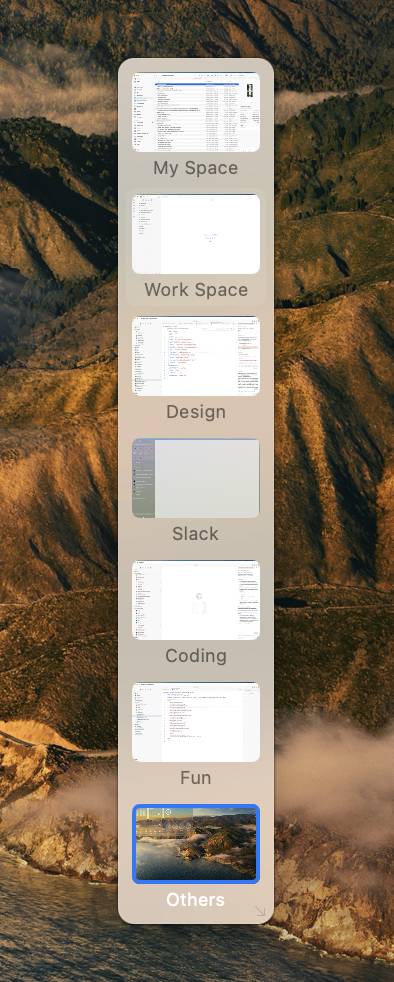

# Deskhopper

Instant space switching for macOS. A floating panel that lives on every desktop, so you never have to swipe again.



## The Problem

If you work across 6-9 macOS Spaces -- code editors, browsers, Slack, design tools, terminals, AI assistants -- you know the pain. Swiping through them one by one is slow. Mission Control is a full-screen interruption. Ctrl+arrow keys only move one space at a time. There is no built-in way to jump directly to Space 7 from Space 2.

Deskhopper fixes this. A small, always-visible panel shows all your spaces and lets you click or hotkey to any one of them instantly.

## Features

- Floating panel visible on all spaces -- never lost behind windows
- One-click switching to any desktop
- Global hotkeys (Ctrl+Option+1-9, configurable modifier key)
- Horizontal or vertical layout
- Desktop preview thumbnails (optional, three sizes) -- previews show "?" until you visit each desktop once
- Configurable opacity (10% idle, 100% on hover, smooth transitions)
- Always-visible or auto-hide mode (panel slides in from screen edge)
- Custom space names per desktop
- Right-click context menu for quick settings
- Menu bar icon with full settings panel (7 tabs)
- Multi-monitor support (spaces grouped by display)
- Drag-to-reposition with edge snapping
- Launch at login
- Fullscreen spaces detected and visually distinguished

## Installation

**Download** the latest DMG from [Releases](https://github.com/aghyad97/Deskhopper/releases), open it, and drag Deskhopper to Applications.

Or build from source:

```bash
git clone https://github.com/aghyad97/Deskhopper.git
cd Deskhopper/Deskhopper
swift build -c release
```

## Usage

Run `Deskhopper` from the terminal or add it to your login items. On first launch, macOS will prompt you to grant Accessibility permission (required for global hotkeys and space switching). The panel appears in the top-right corner by default.

Click any space label to switch to it. Use Ctrl+Option+1 through Ctrl+Option+9 for keyboard switching.

## Configuration

**Right-click the panel** for quick access to common settings: toggle previews, switch orientation, adjust opacity, and switch between always-visible and auto-hide modes.

**Click the menu bar icon** to open the full settings panel with all configuration options.

## Settings Overview

| Setting             | Options                                | Default        |
| ------------------- | -------------------------------------- | -------------- |
| Position            | 12 positions (corners, edges, centers) | Top Right      |
| Orientation         | Horizontal / Vertical                  | Horizontal     |
| Mode                | Always Visible / Auto-Hide             | Always Visible |
| Idle Opacity        | 0% -- 100%                             | 10%            |
| Hover Opacity       | 0% -- 100%                             | 100%           |
| Transition Duration | 0.05s -- 1.0s                          | 0.2s           |
| Previews            | On / Off                               | Off            |
| Preview Size        | Small / Medium / Large                 | Small          |
| Compact Mode        | On / Off                               | On             |
| Hotkeys             | On / Off                               | On             |
| Hotkey Modifier     | Cmd / Ctrl / Option / Ctrl+Option      | Ctrl+Option    |
| Launch at Login     | On / Off                               | Off            |
| Show in Dock        | On / Off                               | Off            |

## Requirements

- macOS 13+ (Ventura, Sonoma, Sequoia, Tahoe)
- Accessibility permission (prompted on first launch)
- Not available on the App Store -- uses private APIs for space management

## How It Works

Deskhopper uses Apple's private SkyLight framework (CGS functions) to enumerate all macOS Spaces, detect the active space, and perform instant switches between them. These functions are resolved at runtime via `dlsym`, with graceful fallback if the API surface changes in a future macOS release. The floating overlay is an `NSPanel` configured to appear on all spaces at a floating window level without activating or stealing focus. Thumbnail previews are captured via `CGWindowListCreateImage` before each space transition.

## Known Limitations

- Deskhopper relies on private macOS APIs that may change between OS versions.
- On first launch, a one-time Dock restart is required to enable proper space switching via the Dock's native code path. This avoids compositor glitches with trackpad swiping and Mission Control.
- Maximum 9 desktops supported for keyboard shortcut switching (Ctrl+1 through Ctrl+9).

## Contributing

Contributions are welcome. If you'd like to help, here's how:

1. **Fork** the repository
2. **Create a branch** for your feature or fix (`git checkout -b fix/some-bug`)
3. **Build and test** locally: `cd Deskhopper && swift build`
4. **Commit** with a clear message describing the change
5. **Open a pull request** against `main`

### Reporting Bugs

Open an [issue](https://github.com/aghyad97/Deskhopper/issues) with:

- macOS version (e.g., 15.4 Sequoia, 16.0 Tahoe)
- Steps to reproduce
- What you expected vs. what happened
- Console logs if available (`Console.app` filtered to "Deskhopper")

### Areas Where Help Is Appreciated

- **Multi-monitor testing** -- space switching and ordering across multiple displays
- **macOS version compatibility** -- testing on Ventura, Sonoma, Sequoia, and Tahoe
- **Accessibility** -- VoiceOver support, keyboard navigation improvements
- **Localization** -- translating space labels and settings UI

## License

[MIT](LICENSE)
